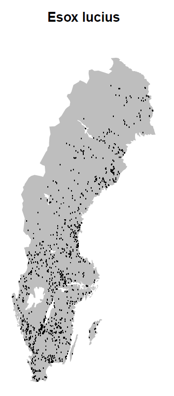

# 🐟 data from SERS

### The data

::: {.notes}
In this example we are interested in exploring data from a specific data resource -- the Swedish Electrofishing Registry - SERS (Department of Aquatic Resources, SLU Aqua). This database has 2.8 M observations starting in the 1950's.

SBDI is a collection of many biodiversity databases. We start by searching for the data resource we are interested in by using the function `pick_filter()`. This is an interactive query guiding you through the many resources available to filtering your query (data resources, spatial layers, and curated species lists).
:::

The Swedish Electrofishing Registry - SERS (Department of Aquatic Resources, SLU Aqua).

> 2.8 M observations starting in the 1950's.

```{r filter1, message=FALSE, eval=FALSE}
fq_str <- pick_filter("resource") 
```

Follow the instructions. Your choices here would have been 'in3' ▶️ 'dr10' (data resource 10 = SERS). Your variable `fq_str` will now contain a string 'data_resource_uid:dr10'.

```{r filter2, message=FALSE, warning=FALSE, include=FALSE}
fq_str <- "data_resource_uid:dr10"
```

### Filter

::: {.notes}
But we are not interested in the complete database, we only want to look at the data from the last 10 years. For this we concatenate (add to a vector) another filter string. Both filter strings (for data resource and for time period) will be treated as AND factors.
:::

```{r filter3}
y1 <- 2008
y2 <- 2012
fq_str <- c(fq_str, paste0("year:[", y1, " TO ", y2,"]"))
# Note the square brackets are hard limits
```

Both filter strings (for data resource and for time period) will be treated as AND factors. For references on how to use the filters see the SBDI APIs [documentation](https://api.biodiversitydata.se/?lang=en-US#ws3).

### Occurrences

Using the function `occurrences()` we can now query for the observations fulfilling our filter. If you haven't specified your email and the download reason in the `sbdi_config()` before, you need to pass this here.

```{r getOcc, cache=TRUE, message=FALSE}
xf <- occurrences(fq = fq_str)

# Remove what is not a species
xf$data <- xf$data[xf$data$rank == "species",]

# Simply summarise all records by data source 
table(xf$data$dataResourceName)
```

```{r save, echo=FALSE, include=FALSE, eval=FALSE}
save(xf, file = "data/tmp_occdata_for compile.rdata")
```

```{r load, echo=FALSE, include=FALSE, eval=FALSE}
load(file = "data/tmp_occdata_for compile.rdata")
```

### Plotting data on a map 

{style="position: relative; float: right; z-index: 10; top:-100px;" width="264"}

You can quickly plot all the observations as a PDF file with the function `ocurrence_plot()`, one page per species:

**Note** that the plot is saved to a .pdf file in the current working directory. You can find that with `getwd()`.

```{r pdf_plot, eval=FALSE}
occurrences_plot(xf, "output/obsPlot.pdf", 
                 grouped=FALSE, 
                 taxon_level="species", 
                 pch='.')
```

### 

There are many other ways of producing spatial plots in R. The leaflet package provides a simple method of producing browser-based maps with panning, zooming, and background layers:

```{r leafletCode, message=FALSE, warning=FALSE, eval=FALSE}
library(leaflet)
# drop any records with missing lat/lon values
xfl <- xf$data[!is.na(xf$data$longitude) | !is.na(xf$data$latitude),] 
marker_colour <- rep("#d95f02", nrow(xfl))
# blank map, with imagery background
leaflet() |> 
  addProviderTiles("Esri.WorldImagery") |>
  # add markers
  addCircleMarkers(xfl$longitude, xfl$latitude,  
                   radius = 1, 
                   fillOpacity =.5, 
                   opacity = 1,
                   col=marker_colour,
                   clusterOptions = markerClusterOptions())
```

### 

```{r leafletDo, echo=FALSE, message=FALSE, warning=FALSE}
library(leaflet)
xfl <- xf$data[!is.na(xf$data$longitude) | !is.na(xf$data$latitude),] 
marker_colour <- rep("#d95f02", nrow(xfl))
leaflet(width = "100%", height = "550px") |> 
  addProviderTiles("Esri.WorldImagery") |>
  addCircleMarkers(xfl$longitude, xfl$latitude,  
                   radius = 1, 
                   fillOpacity =.5, 
                   opacity = 1,
                   col=marker_colour,
                   clusterOptions = markerClusterOptions())
```

### Temporal summary

A quick summary over the years reveals a drop in number of records over time.

```{r timeTableCode, eval=FALSE}
hist(xf$data$year, 
     breaks = seq(y1, y2), 
     xlab = "Year")
```

```{r timeHist, echo=FALSE, fig.height=3.5}
par(mar=c(4,4,1,1))
hist(xf$data$year, 
     breaks = seq(y1, y2), 
     xlab = "Year", 
     main = "")
```

### Species summary

In the same way we can summarise the number of observations for each species, by common or scientific name.

```{r nObsTab, paged.print=TRUE}
sppTab <- table(xf$data$commonName)
sppDF <- as.data.frame(sppTab)
colnames(sppDF)[1] <- "species"
head(sppDF)
```

### 

```{r nObsTab2, paged.print=TRUE}
sppTab <- table(xf$data$scientificName)
sppDF <- as.data.frame(sppTab)
colnames(sppDF)[1] <- "species"
head(sppDF)
```

Perhaps, you want to send this table as a .CSV file to a colleague. Save the table:

```{r savesummary, eval=FALSE}
write.csv(sppDF, "output/SERS_species_summary.csv")
# NOTE: again this will be saved on your working directory
```

### Spatial biodiversity analysis

Let's now ask: How does the species richness vary across Sweden?

::: {.notes}
For this we want to summarise occurrences species-wise over a defined grid instead of plotting every observation point. First we need to overlay the observations with a grid. Here we are using the standard Swedish grids with grid square size of 50, 25, 10 or 5 km provided as data in the SBDI4R package (with Coordinate Reference System = WGS84, EPSG:4326).
:::

```{r overlay, warning=FALSE, message=FALSE}
library(sf) # the function coordinates() and proj4string() are in sp
# load some shapes over Sweden's political borders
data("swe_wgs84", package="SBDI4R", envir=environment())
# a standard 50 km grid
data("Sweden_Grid_50km_Wgs84", package="SBDI4R", envir=environment())
grid <- Sweden_Grid_50km_Wgs84

obs <- st_as_sf(as.data.frame(xf$data),
                coords = c("longitude","latitude"),
                crs = st_crs(4326))

# overlay the occurrence data with the grid
ObsInGridListID <- st_intersects(grid, obs)
ObsInGridList <- lapply(ObsInGridListID, function(x) st_drop_geometry(obs[x,]))
wNonEmpty <- unname( which( unlist(lapply(ObsInGridList, nrow)) != 0) )
if(length(wNonEmpty)==0) message("Observations don't overlap any grid cell.")
```

### 

The result `ObsInGridList` is a `list` object with a subset of the data for each grid cell. Now summarise occurrences within grid cells:

```{r overlay_summary}
# apply a summary over the grid cells 
nCells <- length(ObsInGridList)
res <- data.frame("nObs"=as.numeric(rep(NA,nCells)),
                  "nYears"=as.numeric(rep(NA,nCells)),
                  "nSpp"=as.numeric(rep(NA,nCells)),
                  row.names = row.names(grid),
                  stringsAsFactors = FALSE)

cols2use <- c("scientificName", "year")
dataRes <- lapply(ObsInGridList[wNonEmpty], 
                  function(x){
                    x <- x[,cols2use]
                    colnames(x) <- c("scientificName", "year")
                    return(c("nObs" = length(x[,"scientificName"]),
                             "nYears" = length(unique(x[,"year"])),
                             "nSpp" = length(unique(x[,"scientificName"]))
                             )
                           )
                    }
                  )
dataRes <- as.data.frame(dplyr::bind_rows(dataRes, .id = "gridID"))
res[wNonEmpty,] <- dataRes[,-1]
resSf <- st_as_sf(data.frame(res, st_geometry(grid)))
```

### 

And finally plot the grid summary as a map:

```{r gridPlot, fig.height=6, fig.width=6, echo=FALSE, fig.align='center'}
palBW <- leaflet::colorNumeric(c("white", "navyblue"),
                               c(0, max(resSf$nSpp, na.rm = TRUE)),
                               na.color = "transparent")
oldpar <- par()
par(mar = c(1,1,0,0))
plot(resSf$geometry, col=palBW(resSf$nSpp), border = NA)
plot(swe_wgs84$Border$geometry, border=1, lwd=1, add=T)
legend("bottomleft", 
       legend = round(seq(0, max(resSf$nSpp, na.rm = TRUE), length.out = 5)),
       col = palBW(seq(0, max(resSf$nSpp, na.rm = TRUE), length.out = 5)),
       title = "Number of \nspecies", pch = 15, bty="n")
suppressWarnings(par(oldpar))
```

### 

We may now ask whether species richness varies across latitude. So we go further by arranging the observations by latitude:

```{r sppLatitude, warning=FALSE, message=FALSE}
library(dplyr)
library(tidyr)
xgridded <- xf$data |>
    mutate(longitude = round(longitude * 4)/4, 
           latitude = round(latitude * 4)/4) |>
    group_by(longitude,latitude) |>
    ## subset to vars of interest
    select(longitude, latitude, species) |>
    ## take one row per cell per species (presence)
    distinct() |>
    ## calculate species richness
    mutate(richness=n()) |>
    ## convert to wide format (sites by species)
    mutate(present=1) |>
    do(tidyr::pivot_wider(data=.,  
                          names_from=species, 
                          values_from=present, 
                          values_fill=0)) |>
    ungroup()
## where a species was not present, it will have NA: convert these to 0
sppcols <- setdiff(names(xgridded),
                   c("longitude", "latitude", "richness"))
xgridded <- xgridded |> 
  mutate_at(sppcols, function(z) ifelse(is.na(z), 0, z))
```

### 

And plot it accordingly:

```{r plot_richLat, warning=FALSE, fig.height=3.5, fig.align='center'}
library(ggplot2)

ggplot(xgridded, aes(latitude, richness)) + 
  labs(x = "Latitude (º)", 
       y = "Species richness") +
  lims(y = c(0,20)) +
  geom_point() + 
  theme_bw()
```
